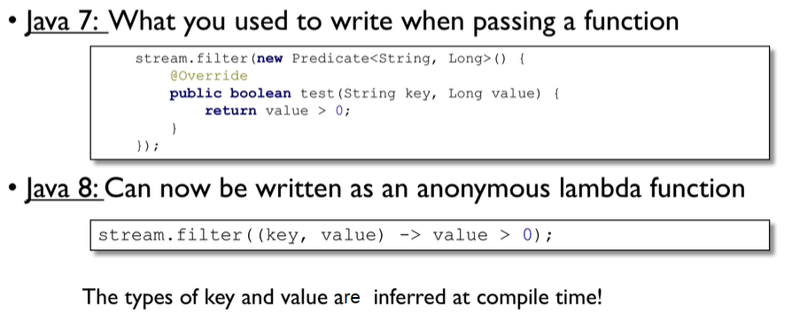

# Java 8 Note 

- [Java 8 Note](#java-8-note)
	- [Lambda Functions](#lambda-functions)
	- [Functional Interfaces](#functional-interfaces)
		- [Java Build-in Functional Interfaces](#java-build-in-functional-interfaces)
			- [`Predicate<T>`](#predicatet)
			- [`Consumer<T>`](#consumert)
			- [`BiConsumer<T, U>`](#biconsumert-u)
	- [Method References](#method-references)
	- [Default Methods](#default-methods)
	- [Stream API](#stream-api)
		- [Collectors](#collectors)
		- [Statistics](#statistics)
	- [Iteration](#iteration)
	- [`Optional`](#optional)

---

## Lambda Functions



---

## Functional Interfaces

Functional interface: The interface only has one abstract method, which is used for declaring lambda functions. 

If you use an interface to declare the lambda function, this interface can only have one abstract method. But it is allowed to have one or more implemented methods.  

`Runnable` interface is a typical example as it only contains one abstract method: `run()`.

From Java 8, an interface can have implemented methods. (Before Java 8, an interface can only have abstract methods.)

In order to make sure the interface is a functional interface and it will not be misused by others, it is a **good practice** to add the annotation `@FunctionalInterface` at the top of the interface, although it is optional.

### Java Build-in Functional Interfaces

Java 8 has some out-of-box interfaces for using lambda expression in common scenarios, such as `Prediction`, `Supplier`, and `Function`, so that you do not need to create an interface yourself. 

#### `Predicate<T>`

Represents a predicate (boolean-valued function) of one argument. Accepts a single input argument and returns a boolean result. 

There is a method `test(Object)` in this interface to return a Boolean value.

#### `Consumer<T>`

Represents an operation that accepts a single input argument and returns no result. E.g. print an object. 

#### `BiConsumer<T, U>`	

Represents an operation that accepts two input arguments and returns no result.

---

## Method References 

Method references help to point to methods by their names. A method reference is described using `::` symbol. A method reference can be used to point the following types of methods:

- Static methods
- Instance methods
- Constructors using `new` operator (`TreeSet::new`)

---

## Default Methods

Prior to Java 8, there can only be abstract methods in interfaces. Java 8 allows us to add non-abstract methods in the interfaces. These methods must be declared `default` methods. Default methods were introduced in Java 8 to enable the functionality of lambda expression.

---

## Stream API

Stream is a sequence of elements supporting sequential and parallel aggregate operations. 

Three elements of the stream: 

- Source: Collections, Arrays, or I/O resources. 
- Operations that need to be performed on the stream, such as filter, map, limit, reduce, find, match, and so on. Most of the stream operations return stream itself so that their result can be pipelined. These operations are called intermediate operations and their function is to take input, process them, and return output to the target.
- Terminal operation or end condition, e.g. `collect()` method.

Two ways to generate streams: 

- `.stream()`: Returns a sequential stream considering collection as its source.
- `.parallelStream()`: Returns a parallel Stream considering collection as its source. Parallel stream can be created if multiple cores are potentially to be used. 

### Collectors

Collectors are used to combine the result of processing on the elements of a stream. Collectors can be used to return a list or a string.

```java
List<String> strings = Arrays.asList("abc", "", "bc", "efg", "abcd", "", "jkl");

List<String> filtered = strings.stream().filter(string -> !string.isEmpty()).collect(Collectors.toList());

String mergedString = strings.stream().filter(string -> !string.isEmpty()).collect(Collectors.joining(", "));
```

### Statistics

With Java 8, statistics collectors are introduced to calculate all statistics when stream processing is being done.

```java
List numbers = Arrays.asList(3, 2, 2, 3, 7, 3, 5);

IntSummaryStatistics stats = numbers.stream().mapToInt((x) -> x).summaryStatistics();

stats.getMax();
stats.getMin();
stats.getSum();
stats.getAverage();
```

---

## Iteration 

In Java 7, for loop and foreach loop are external iteration. 

In Java 8, the `forEach()` method of collection is internal iteration, which makes it possible to use multi-threading and parallelism. 

---

## `Optional`

`Optional` is a container object used to contain not-null objects. 

